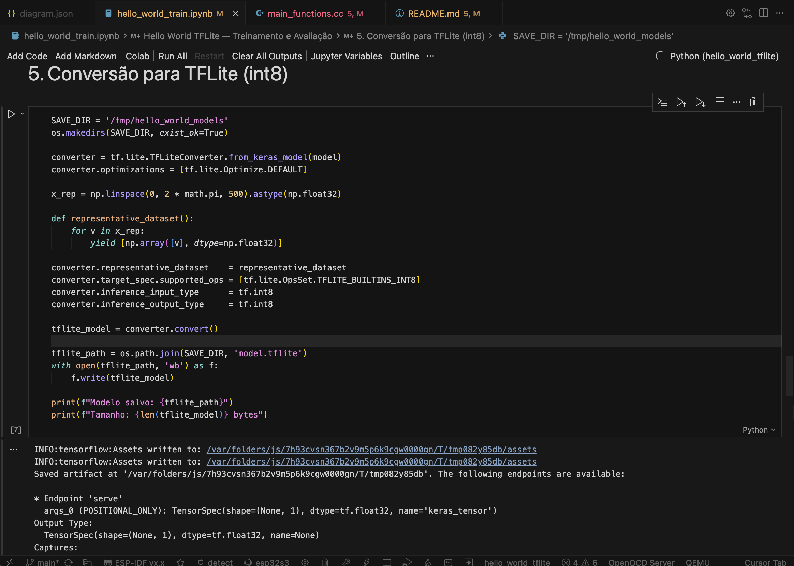
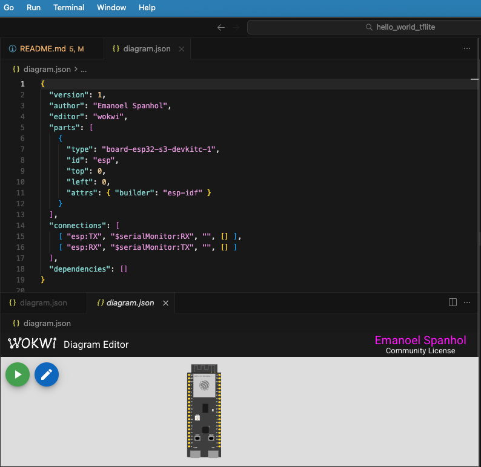
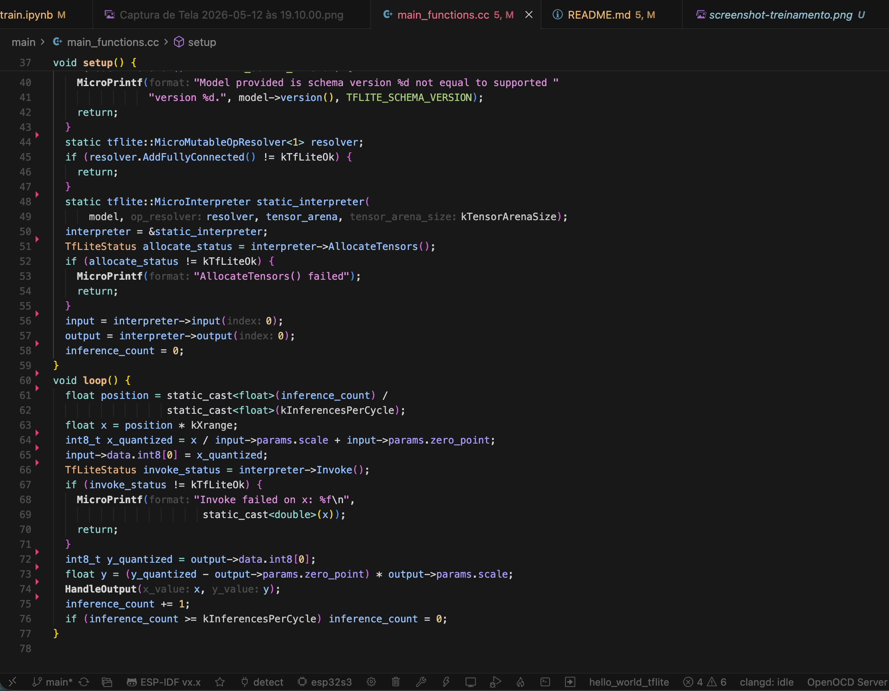
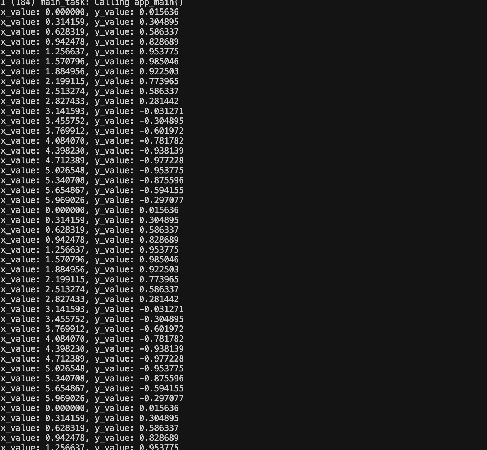

# Hello World com TensorFlow Lite Micro

**Disciplina:** IA Embarcada  
**Data:** 10/05/2026  
**Aluno:** Emanoel Spanhol

Aplicação embarcada em C++ para ESP32-S3, usando ESP-IDF no Cursor e simulação no Wokwi. O projeto executa uma rede neural diretamente no microcontrolador, sem sistema operacional, sem sistema de arquivos, com pouquíssima memória disponível. A tarefa da rede é prever `y = sin(x)` dado um valor de entrada `x`.

---

## Estrutura de Arquivos

```
hello_world_tflite/
├── CMakeLists.txt            # CMake raiz do projeto ESP-IDF
├── sdkconfig.defaults        # Configurações de build (CPU, flash, otimizações)
├── wokwi.toml                # Configuração do simulador Wokwi
├── diagram.json              # Circuito do Wokwi (ESP32-S3 + serial monitor)
├── dependencies.lock         # Versões fixadas das dependências ESP-IDF
├── train.py                  # Script Python para treinar e gerar o modelo
├── hello_world_train.ipynb   # Notebook com experimentos de treinamento
└── main/
    ├── CMakeLists.txt        # Registro do componente e arquivos-fonte
    ├── idf_component.yml     # Dependência do esp-tflite-micro (^1.3.5)
    ├── main.cc               # Ponto de entrada (app_main, loop a cada 500ms)
    ├── main_functions.cc     # setup() e loop(): inicialização e inferência
    ├── main_functions.h      # Declarações de setup() e loop()
    ├── constants.h           # kXrange (2π) e declaração de kInferencesPerCycle
    ├── constants.cc          # kInferencesPerCycle = 20
    ├── model.cc              # Modelo TFLite como array de bytes (g_model[])
    ├── model.h               # Declaração de g_model e g_model_len
    ├── output_handler.cc     # HandleOutput(): imprime x e y no serial via MicroPrintf
    └── output_handler.h      # Declaração de HandleOutput()
```

---

## O Modelo

### Arquitetura

A rede neural foi treinada para aproximar a função seno. Ela é composta por três camadas densas:

| Camada | Tipo | Neurônios | Ativação |
| --- | --- | --- | --- |
| 1 | Dense | 16 | ReLU |
| 2 | Dense | 16 | ReLU |
| 3 (saída) | Dense | 1 | Linear |

A entrada é um único valor `x` (escalar) e a saída é o valor previsto `y = sin(x)`.

### Treinamento

O script `train.py` gera os dados e treina o modelo:

- **Amostras:** 1500 pontos aleatórios no intervalo [0, 2π]
- **Ruído:** pequeno ruído gaussiano adicionado (σ = 0.01) para melhor generalização
- **Épocas:** 600
- **Batch size:** 32
- **Otimizador:** Adam (learning rate = 0.001)
- **Loss:** MSE | **Métrica:** MAE
- **Split:** 20% para validação

```python
# Trecho de train.py — arquitetura e compilação
model = tf.keras.Sequential([
    tf.keras.layers.Dense(16, activation="relu", input_shape=(1,)),
    tf.keras.layers.Dense(16, activation="relu"),
    tf.keras.layers.Dense(1),
])
model.compile(optimizer=tf.keras.optimizers.Adam(learning_rate=0.001),
              loss="mse", metrics=["mae"])
```

A imagem abaixo mostra o notebook/script de treinamento com a curva de loss e o modelo sendo gerado:



### Compressão e Conversão para TFLite (INT8)

Após o treinamento, o modelo é convertido para o formato **TFLite** com quantização **full-integer INT8**. Essa técnica reduz os pesos e ativações de 32 bits (float32) para 8 bits (int8), diminuindo o tamanho do modelo em ~4× e o consumo de memória em runtime.

```python
# Trecho de train.py — conversão e quantização INT8
converter = tf.lite.TFLiteConverter.from_keras_model(model)
converter.optimizations = [tf.lite.Optimize.DEFAULT]
converter.target_spec.supported_ops = [tf.lite.OpsSet.TFLITE_BUILTINS_INT8]
converter.inference_input_type = tf.int8
converter.inference_output_type = tf.int8

# Dataset representativo: 200 pontos de 0 a 2π para calibrar a quantização
x_rep = np.linspace(0, 2 * math.pi, 200).astype(np.float32)
def representative_dataset():
    for val in x_rep:
        yield [np.array([val], dtype=np.float32)]
converter.representative_dataset = representative_dataset

tflite_model = converter.convert()
```

O modelo quantizado ocupa apenas **~3,4 KB**, cabendo na memória flash do microcontrolador. Para embutir o modelo no firmware, o arquivo `.tflite` é convertido em um array C com:

```bash
xxd -i model.tflite > main/model.cc
```

O resultado é o array `g_model[]` alinhado a 8 bytes, declarado em `model.cc` e compilado junto com o firmware — sem necessidade de sistema de arquivos.

---

## Configurações

### `sdkconfig.defaults` — Configurações de Build

| Configuração | Valor | Efeito |
| --- | --- | --- |
| `CONFIG_ESP_DEFAULT_CPU_FREQ_MHZ` | 240 | CPU a 240 MHz (máximo do ESP32-S3) |
| `CONFIG_ESPTOOLPY_FLASHMODE_QIO` | y | Flash em modo Quad I/O (mais rápido) |
| `CONFIG_ESPTOOLPY_FLASHFREQ_80M` | y | Clock da flash a 80 MHz |
| `CONFIG_ESP_INT_WDT` | n | Watchdog de interrupção desativado |
| `CONFIG_ESP_TASK_WDT_INIT` | n | Watchdog de tarefa desativado |
| `CONFIG_COMPILER_OPTIMIZATION_PERF` | y | Otimização `-O2` para performance |

### `wokwi.toml` — Simulador

```toml
[wokwi]
version = 1
firmware = 'build/flasher_args.json'
elf = 'build/hello_world_tflite.elf'
```

Aponta para os artefatos gerados pelo `idf.py build`. O Wokwi lê o `.elf` para a simulação e o `flasher_args.json` para saber quais binários carregar.

### `diagram.json` — Circuito

O circuito é minimalista: apenas a placa ESP32-S3-DevKitC-1 conectada ao monitor serial. Não há sensores ou periféricos externos — toda a entrada é gerada por software.

| Componente | Pino | Conexão |
| --- | --- | --- |
| ESP32-S3 | TX | Serial Monitor RX |
| ESP32-S3 | RX | Serial Monitor TX |

### `main/idf_component.yml` — Dependências

```yaml
dependencies:
  espressif/esp-tflite-micro:
    version: "^1.3.5"
```

A versão resolvida no `dependencies.lock` é:

| Componente | Versão | Função |
| --- | --- | --- |
| `espressif/esp-tflite-micro` | 1.3.5 | Runtime do TFLite Micro para ESP-IDF |
| `espressif/esp-nn` | 1.2.3 | Kernels otimizados para ESP32-S3 (SIMD/XTENSA) |
| `idf` | 6.1.0 | ESP-IDF base |

A imagem abaixo mostra o arquivo `diagram.json` e as configurações abertas no Cursor:



---

## Código Principal

Arquivo: `main/main_functions.cc`

### `setup()` — Inicialização

```cpp
// Carrega o modelo do array de bytes (zero-copy, sem parsing)
model = tflite::GetModel(g_model);

// Registra apenas o operador necessário: FullyConnected
static tflite::MicroMutableOpResolver<1> resolver;
resolver.AddFullyConnected();

// Arena de memória estática: 2000 bytes alocados em RAM
constexpr int kTensorArenaSize = 2000;
uint8_t tensor_arena[kTensorArenaSize];

// Cria o interpretador e aloca os tensores
static tflite::MicroInterpreter static_interpreter(
    model, resolver, tensor_arena, kTensorArenaSize);
interpreter->AllocateTensors();
```

O `MicroMutableOpResolver<1>` garante que apenas o operador `FullyConnected` seja incluído no firmware, reduzindo o tamanho do binário. A arena de 2000 bytes é toda a memória disponível para os tensores em runtime.

### `loop()` — Inferência e Quantização

A cada iteração, o programa:

1. Calcula o `x` atual com base no contador de inferências e no intervalo [0, 2π]
2. **Quantiza** o `x` de float para int8 usando os parâmetros de escala e zero-point do tensor de entrada
3. Executa a inferência (`interpreter->Invoke()`)
4. **Dequantiza** o resultado de int8 para float usando os parâmetros do tensor de saída
5. Imprime `(x, y)` no serial e incrementa o contador

```cpp
// Quantização da entrada: float → int8
float x = position * kXrange;
int8_t x_quantized = x / input->params.scale + input->params.zero_point;
input->data.int8[0] = x_quantized;

// Inferência
interpreter->Invoke();

// Dequantização da saída: int8 → float
int8_t y_quantized = output->data.int8[0];
float y = (y_quantized - output->params.zero_point) * output->params.scale;

HandleOutput(x, y);
```

Os parâmetros `scale` e `zero_point` são gravados no modelo durante a quantização e garantem que a conversão int8 ↔ float preserve a faixa numérica correta.

### `main.cc` — Entrypoint

```cpp
extern "C" void app_main(void) {
  setup();
  while (true) {
    loop();
    vTaskDelay(pdMS_TO_TICKS(500));  // 1 inferência a cada 500ms
  }
}
```

O delay de 500ms é intencional: torna o log legível no monitor serial. Com `kInferencesPerCycle = 20`, um ciclo completo de 0 a 2π leva ~10 segundos.

A imagem abaixo mostra o arquivo `main_functions.cc` aberto no Cursor com o trecho da inferência:



---

## Como Compilar

No terminal, dentro desta pasta:

```bash
source ~/esp-idf/export.sh
idf.py set-target esp32s3
idf.py build
```

O build gera:

```text
build/hello_world_tflite.bin
build/hello_world_tflite.elf
build/flasher_args.json
```

---

## Como Simular no Cursor/VS Code

1. Abra esta pasta no Cursor ou VS Code.
2. Verifique se a extensão Wokwi Simulator está logada com a conta/licença.
3. Execute `F1 → Wokwi: Start Simulator`.
4. Abra a aba `Wokwi Terminal`.
5. As leituras devem aparecer no formato:

```text
x_value: 0.000000, y_value: 0.000000
x_value: 0.314159, y_value: 0.309017
x_value: 0.628318, y_value: 0.587785
x_value: 0.942478, y_value: 0.809017
...
```

---

## Análise da Predição

A cada iteração, o microcontrolador percorre `kInferencesPerCycle = 20` pontos igualmente espaçados entre 0 e 2π. Os valores de `y` previstos seguem a curva esperada do seno:

| Fase | x | y esperado | y previsto |
| --- | --- | --- | --- |
| Início | 0 | 0.000 | ~0.000 |
| Pico | π/2 ≈ 1.571 | 1.000 | ~0.95–1.00 |
| Zero | π ≈ 3.142 | 0.000 | ~0.000 |
| Vale | 3π/2 ≈ 4.712 | -1.000 | ~-0.95–-1.00 |
| Retorno | 2π ≈ 6.283 | 0.000 | ~0.000 |

O pequeno erro nos picos (~5%) é esperado da quantização INT8 — cada peso tem resolução de 1/128 da faixa total. Isso confirma que o modelo aprendeu a aproximar corretamente a função seno mesmo operando em aritmética inteira com 2 KB de arena.

---

## Prints da Simulação

### Simulação em execução no Wokwi

A imagem abaixo mostra a simulação em execução com o monitor serial imprimindo os pares `(x, y)`:


### Monitor serial completo (ciclo inteiro)

A imagem abaixo mostra um ciclo completo de 20 inferências de 0 a 2π no serial:



---

## Arquivos Principais para Entrega

- `CMakeLists.txt`
- `sdkconfig.defaults`
- `wokwi.toml`
- `diagram.json`
- `dependencies.lock`
- `main/CMakeLists.txt`
- `main/idf_component.yml`
- `main/main.cc`
- `main/main_functions.cc`
- `main/main_functions.h`
- `main/constants.h`
- `main/constants.cc`
- `main/model.cc`
- `main/model.h`
- `main/output_handler.cc`
- `main/output_handler.h`
- `train.py`
- `hello_world_train.ipynb`

---

## Referências

- TFLite Micro Hello World: https://github.com/tensorflow/tflite-micro/tree/main/tensorflow/lite/micro/examples/hello_world
- ESP-TFLite-Micro Component: https://components.espressif.com/components/espressif/esp-tflite-micro
- ESP-NN (kernels otimizados): https://components.espressif.com/components/espressif/esp-nn
- Wokwi ESP32-S3: https://docs.wokwi.com/parts/board-esp32-s3-devkitc-1
